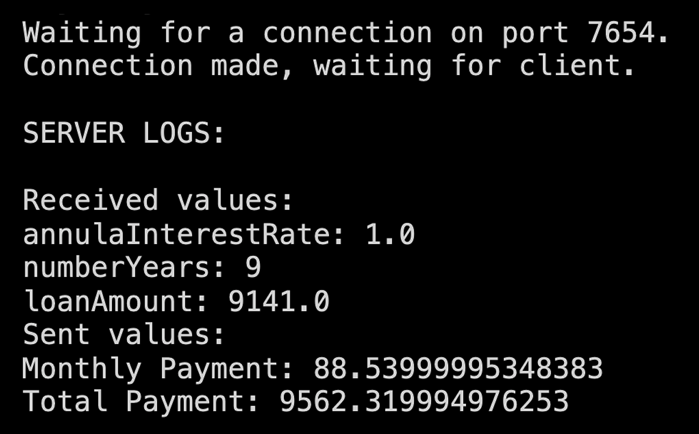

# bank-account-socket

This repo contains a client / server application which implements socket communication.

# Description

## Client

The client sends loan information to the server:

**Loan information:**

- annual interest rate (first digit of your student id),
- number of years (2nd digit of your studentid),
- loan amount = last four digits of your studentID (x12345678)

## Server

The server computes monthly payment and total payment,
and sends them back to the client.

