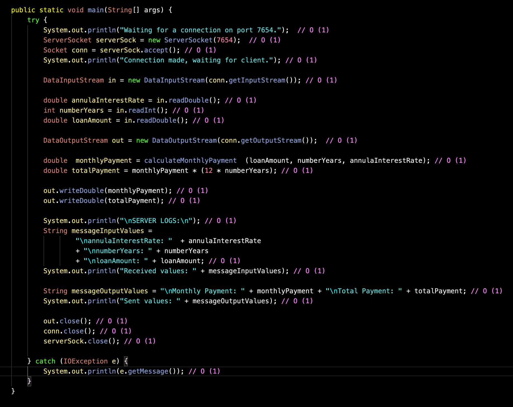

# Bank account Client/Server application

This repo contains a client / server application which implements socket communication.

# Description

## Client

The client sends loan information to the server:

**Loan information:**

- annual interest rate (first digit of your student id),
- number of years (2nd digit of your studentid),
- loan amount = last four digits of your studentID (x12345678)

## Server

The server computes monthly payment and total payment,
and sends them back to the client.

# Big O notation - Computational complexity

## Big O notation - Client

Every line of the Client has at most O(1) complexity.
So the worst case is O(1)

## Big O notation - Server

As happen for the Client, Every line of the Server has at most O(1) complexity.
so the worst case is O(1)

